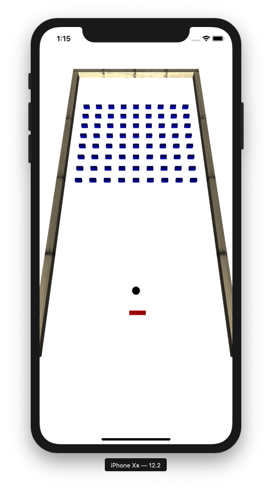

# LearningOpenGLES2

Learning OpenGL ES 2 in Swift. There is an OpenGL ES 2.0 Tutorial at [Raywenderlich channel on Youtube](https://www.youtube.com/playlist?list=PL23Revp-82LL_XoQEiTT6zsgHHrpjr1D9) or [www.raywenderlich.com](https://www.raywenderlich.com/69983/video-tutorial-beginner-opengl-es-glkit-part-0-introduction). This tutorial is really great! If you have to learn the opengl es 2.0, you'd like to watch the opengl es 2.0 video tutorial whatever you are iOS developer or Android developer. But This tutorial's example was written in ObjectiveC. So I've made the examples in swift while I am following the tutorial. I've excepted last four examples for making game in 3D.

## Support Swift language version
 * `master` branch: Swift 5
 * `swift/4.0` branch : Swift 4.0
 * `swift/3.x` branch : Swift 3.x
 
## Contributors
 * Yoon-Soo, Lee([dansoonie](https://github.com/dansoonie))
 	* He converted all the source code to Swift 3.0 and stabilized it.
 * Michael([mrommel](https://github.com/mrommel))
 	* He helped implement obj model loader and examples.
 * Keith([KeithPiTsui](https://github.com/KeithPiTsui))
 	* He helped implement final game project in swift. 
 * DongHyuk Kim, ([sss989870](https://github.com/sss989870))
 	* He helped improve code quality.
 
## Hello OpenGL

## Red Alert

## Star

## Triangle

## Colored Square

## Indexed Square

## Vertex Array Object

## Model

## Model Transformation

## Model Transformation-Animation

## View Transformation

## Projection Transformation

## Animate Cube

## DepthAndCulling

## Texture

## Multi Texture

## Masking

## Ambient Light

## DiffuseLight

## SpecularLight

## ObjModelLoader

obj parsing taken from here:
* https://github.com/k0nserv/SwiftObjLoader

## BrickBreakerGame

## Ray Wenderlich License

The Ray Wenderlich License

Copyright (c) 2010, 2011 Ray Wenderlich [https://www.raywenderlich.com/faq](https://www.raywenderlich.com/faq)

Permission is hereby granted, free of charge, to any person obtaining a copy of this software to deal in the Software without restriction, including without limitation the rights to use, copy, modify, merge, publish, distribute, sublicense, and/or sell copies of the Software, and to permit persons to whom the Software is furnished to do so, subject to the following conditions:

The above copyright notice and this permission notice shall be included in all copies or substantial portions of the Software.

THE SOFTWARE IS PROVIDED “AS IS”, WITHOUT WARRANTY OF ANY KIND, EXPRESS OR IMPLIED, INCLUDING BUT NOT LIMITED TO THE WARRANTIES OF MERCHANTABILITY, FITNESS FOR A PARTICULAR PURPOSE AND NONINFRINGEMENT. IN NO EVENT SHALL THE AUTHORS OR COPYRIGHT HOLDERS BE LIABLE FOR ANY CLAIM, DAMAGES OR OTHER LIABILITY, WHETHER IN AN ACTION OF CONTRACT, TORT OR OTHERWISE, ARISING FROM, OUT OF OR IN CONNECTION WITH THE SOFTWARE OR THE USE OR OTHER DEALINGS IN THE SOFTWARE.
